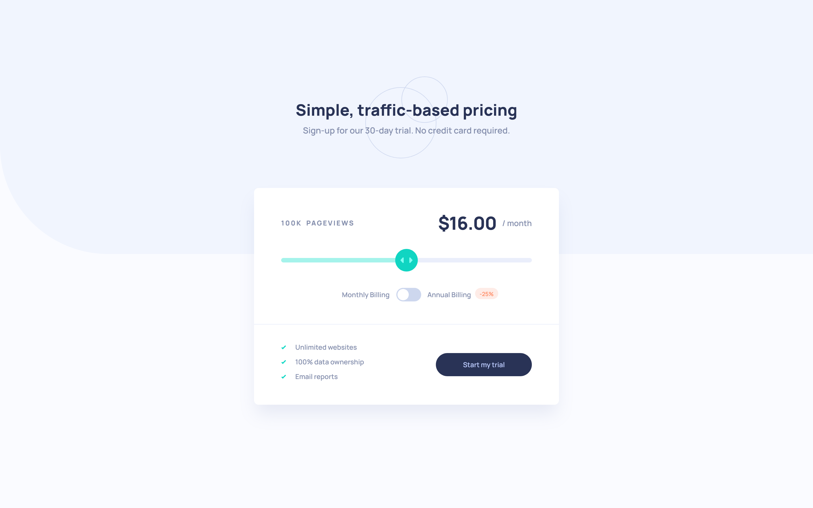

# Frontend Mentor - Interactive pricing component solution

This is a solution to the [Interactive pricing component challenge on Frontend Mentor](https://www.frontendmentor.io/challenges/interactive-pricing-component-t0m8PIyY8). Frontend Mentor challenges help you improve your coding skills by building realistic projects. 

## Table of contents

- [Overview](#overview)
  - [The challenge](#the-challenge)
  - [Screenshot](#screenshot)
  - [Links](#links)
- [My process](#my-process)
  - [Built with](#built-with)
  - [What I learned](#what-i-learned)
  - [Continued development](#continued-development)
  - [Useful resources](#useful-resources)
- [Author](#author)
- [Acknowledgments](#acknowledgments)

## Overview

### The challenge

Users should be able to:

- View the optimal layout for the app depending on their device's screen size
- See hover states for all interactive elements on the page
- Use the slider and toggle to see prices for different page view numbers

### Screenshot



### Links

- [See the solution on Frontend Mentor](https://www.frontendmentor.io/solutions/scss-vanilla-js-and-tried-my-best-to-make-this-accessible-YER7xLBaK)
- [View the live site](https://interactive-pricing-component-lemon-eight.vercel.app/)

## My process

### Built with

- Semantic HTML5 markup
- ARIA attributes for accessibility
- CSS custom properties
- Flexbox
- CSS Grid
- Mobile-first workflow
- Vanilla JavaScript

### What I learned

- How to create an accessible toggle using `input type="radio"`

- How to add custom styles to `input type="range"` to ensure they work across major browsers:

```scss
@mixin track() {
	width: 100%;
	height: 0.5rem;
	border-color: transparent;
	border-radius: 5px;
	color: transparent;
	cursor: pointer;
}

@mixin thumb() {
	-webkit-appearance: none;
	height: $thumb-size;
	width: $thumb-size;
	margin-top: calc(#{$track-height} / 2 - #{$thumb-size} / 2);
	background-color: $slider-thumb;
	background-image: url('/images/icon-slider.svg');
	background-repeat: no-repeat;
	background-position: center;
	border: none;
	border-radius: 50%;
	cursor: pointer;
}
```

- How to add custom focus style to the slider to ensure they work across major browsers: 
```scss
.pricing__slider {
    &:focus {
        outline: 0;
    }

    &:focus::-webkit-slider-thumb {
        background-color: $slider-thumb-active;
        box-shadow: 0 0 0 1px #fff, 0 0 0 0.25rem $slider-bar;
    }

    &:focus::-moz-range-thumb {
        background-color: $slider-thumb-active;
        box-shadow: 0 0 0 1px #fff, 0 0 0 0.25rem $slider-bar;
    }
}
```

- How to use ARIA live regions to let screen reader users know about changes on the page. I think I now understand better how to approach accesibility issues. Initially, I used aria-live attributes on the elements which where dynamically updated. This caused certain issues: for example, the number of page views was not read out correctly, and the price was read as `dollar {number} slash month`. Of course, this is better than nothing, but could be confusing to screen reader users. Then, I added aria-labels to those elements which were dynamically updated with the content, which was an improvement, however some issues remained. Namely, when the billing frequency was switched from monthly to annual (or the other way round), the price would be updated and the change was read out, but pageviews did not change and so would not be read out. Again, this may not be a crucial issue but it would mean that the page would be more difficult to navigate for screen reader users than for sighted users. I decided to hide the visible dynamic content to screen reader and add a visually hidden element to hold that data to ensure that it is read correctly and that when any change is made within the form, full information is accessible to screen reader users.

### Continued development

I would like to continue learning about accessibility on the web and ARIA attributes.

### Useful resources

The following CSS Tricks articles helped me style the range input:
- [Styling Cross-Browser Compatible Range Inbputs with CSS](https://css-tricks.com/styling-cross-browser-compatible-range-inputs-css/)
- [A Sliding Nightmare: Understanding the Range Input](https://css-tricks.com/sliding-nightmare-understanding-range-input/)

I learnt how to create an accessible toggle based on this Frontend Mentor Solution by @GraceSnow:
- [Accessible toggle in HTML, CSS and JS with explanatory notes](https://www.frontendmentor.io/solutions/accessible-toggle-in-html-css-and-js-with-explanatory-notes-Z6gD3qfGl)

## Author

- Frontend Mentor - [@AgataLiberska](https://www.frontendmentor.io/profile/AgataLiberska)

## Acknowledgments

Massive thanks to Grace Snow who made the effort to answer my many questions about making this accessible!